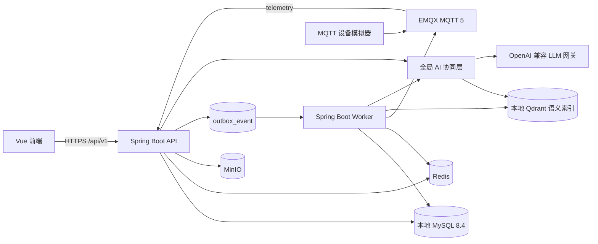
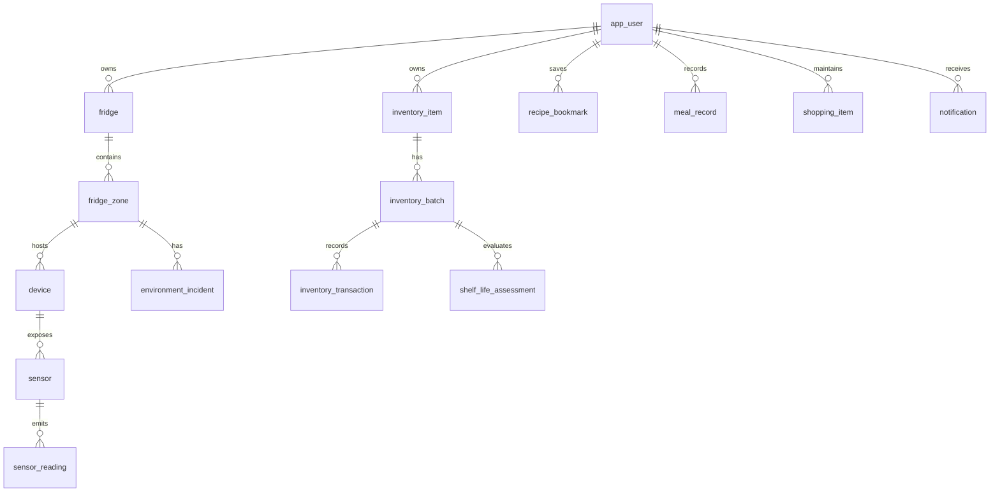

# 智慧冰箱后端建设方案

> 版本：v1.3  
> 更新日期：2026-08-17  
> 技术基线：Java 21、Spring Boot 3、本地 MySQL 8.4、Redis、EMQX MQTT、MinIO、Docker Compose

## 1. 建设目标与边界

本方案为“鲜知”智慧冰箱提供可持续演进的后端实现蓝图，解决以下问题：

- 以独立个人账号为边界持久化冰箱、库存、菜谱、饮食和采购数据；用户必须从登录/注册页进入系统，并在首次进入主界面前完成冰箱初始化。
- 接收并保存温湿度遥测数据，判断环境异常，并让异常对保质期估算产生可解释、不可逆的影响。
- 接入经授权的大规模菜谱数据源，归一化、去重、审核并保存在本地 MySQL；以菜谱知识库为基础让 AI 检索、引用和组合菜谱，而非用用户数据训练模型。
- 以全局 AI 协同层汇总库存、环境、保质期、饮食、采购、菜谱知识和用户偏好，在每个页面提供连贯的问答、主动洞察和可确认的行动建议；LLM 不承担食品安全判断，也不能绕过业务规则直接写数据。
- 让前端从本地 `reactive` 模拟状态迁移为受鉴权保护的真实 API。

首期采用**模块化单体**：一个代码仓库、一个领域模型、API 与后台 Worker 两个可独立扩缩的运行进程。业务模块不得跨模块直接访问持久层；跨模块副作用通过领域事件和事务 Outbox 传递。该形态比微服务更适合当前单一产品与小规模设备接入，也保留后续拆分 `telemetry`、`ai` 或 `notification` 服务的边界。

### 1.1 范围

| 纳入 | 不纳入首期 |
| --- | --- |
| 邮箱密码账户、刷新令牌、用户数据隔离、首次登录初始化 | 手机号登录、第三方 OAuth、家庭成员协作 |
| 冰箱、分区、传感器、MQTT 遥测与模拟器 | 厂商私有设备协议和远程控温指令 |
| 库存批次、库存流水、保质期、提醒、采购清单、语音食材录入 | OCR 小票 |
| 经授权菜谱数据源接入、菜谱知识检索、规则匹配、收藏、做菜扣减、饮食记录与统计 | 医疗诊断、处方和食品安全保证、未获授权的网站抓取 |
| 全局 AI 助手、名称联想和营养估算 | 将原始用户数据用于模型训练 |

### 1.2 首次访问与初始化流程

用户是独立个体，系统不提供匿名主界面。前端必须先展示登录/注册页；注册成功或登录成功后，后端在会话响应中返回 `onboardingRequired`。当该值为 `true`，前端只能进入初始化向导，不能加载或跳转至首页、库存、环境、菜谱、饮食和采购页面。

初始化向导由前端先完成交互和 Mock 契约，再由后端实现对应接口。流程固定为：

1. **分区配置**：选择 3-6 个分区，逐一填写唯一名称。
2. **传感器配置**：对每个分区选择温度传感器和湿度传感器的数量，单类范围为 0-4 个。允许为 0，此时该指标使用目标值/默认值估算，并在前端明确标示“未接入传感器”。
3. **确认与进入主界面**：前端展示分区、名称、传感器数量和默认目标温湿度的汇总；用户确认后一次性提交，后端在单一事务中创建冰箱、分区和处于 `PENDING_BIND` 状态的逻辑传感器槽位，并将 `onboarding_completed_at` 写入用户记录。

初始化已完成的用户进入主界面后仍可在设置中增减分区和传感器槽位，但缩减配置只停用资源，不删除既有遥测、库存或审计数据。未绑定的槽位可由设备接入或第三方调试模拟器绑定；一个物理设备/传感器只能绑定到当前用户拥有的一个逻辑槽位。

### 1.3 当前前端现状与迁移约束

前端为 Vue 3/Vite 原型。除以下远端入口外，库存、分区、提醒、购物、历史和设置仍仅存在于页面状态：

- `POST /api/recipes/generate`
- `GET /api/name-suggestions`
- `POST /api/meals/estimate-nutrition`
- `POST /api/recipe-synthesis/match`

当前 `AssistantPet` 仅根据关键词在浏览器内跳转页面，不读取真实全局状态。迁移后它改为所有页面共用的 `assistant` 客户端：页面切换时提交最小 `page/selection` 上下文，展示后端返回的引用、主动洞察和待确认操作；页面本身仍通过各自领域 API 渲染数据，不能把 AI 回复当作事实数据源。

后端的正式接口统一使用 `/api/v1` 前缀和响应信封。前端改造时，将 `src/services/api.js` 改为：附带访问令牌、解析 `data` 字段、将全部页面读写收口到 API 层。为了允许分步发布，后端在迁移期保留上列四个无版本别名；别名使用相同鉴权和业务逻辑，但返回当前组件所需的原始对象，例如 `{ recipes: [...] }`。前端切换完成并稳定一个发布周期后移除别名。

## 2. 总体架构



### 2.1 运行组件

| 组件 | 职责 | 首期实现 |
| --- | --- | --- |
| `api` | REST API、认证、请求校验、权限、MQTT 消费、同步查询 | Spring Boot Web、Spring Security、Spring Data JPA、Spring Integration MQTT |
| `worker` | Outbox 投递、提醒扫描、保质期重算、统计聚合、AI 主动洞察任务 | 与 `api` 同一 JAR，不同 Spring Profile |
| `assistant` | 汇聚跨模块上下文、解析意图、生成回复/洞察/行动草案 | 同一 JAR 的应用模块；通过受控 Query Port 读取各领域 |
| `mysql` | 本地事务数据、Outbox、审计和传感器时序数据 | MySQL 8.4 LTS、`utf8mb4`、本地持久化 volume |
| `redis` | 刷新令牌撤销索引、限流、缓存、短期幂等键 | Redis 7 |
| `qdrant` | 菜谱知识块的可重建语义检索索引 | 本地 Qdrant；MySQL 是唯一权威数据源，索引丢失可由 Worker 重建 |
| `emqx` | MQTT 5 Broker、主题 ACL、设备连接管理 | EMQX 5 |
| `minio` | 语音录入原文件、将来图片和导入文件 | MinIO；语音文件由 Worker 转写后按保留策略删除，首期不要求图片识别 |
| `simulator` | 向 EMQX 按设定曲线发送温湿度数据 | 独立小型 Java/Node 容器 |

### 2.2 工程结构

```text
backend/
  src/main/java/com/xianzhi/fridge/
    shared/             # 错误、响应、时间、审计、幂等、Outbox
    identity/           # 用户、会话、权限
    fridge/             # 冰箱、分区、设备、传感器
    telemetry/          # MQTT、读数、环境异常、聚合
    inventory/          # 食材目录、批次、库存流水、保质期
    recipe/             # 菜谱、授权数据源导入、知识块、匹配、收藏、做菜记录
    nutrition/          # 食物营养、饮食记录、估算
    shopping/           # 采购清单和补货建议
    notification/       # 站内提醒与投递适配器
    speech/             # 语音上传、转写、食材草稿解析与确认
    analytics/          # 周/月聚合
    assistant/          # 全局上下文、会话、意图路由、洞察和行动草案
    ai/                 # LLM/Embedding Port、RAG、Schema 校验、Fallback
  src/main/resources/db/migration/
  src/test/java/
  Dockerfile
compose.yaml
.env.example
```

每个业务模块内部固定为 `api`（Controller/DTO）、`application`（用例）、`domain`（聚合/规则）、`infrastructure`（JPA、MQTT、外部客户端）四层。Controller 不得直接返回实体，不得在事务外修改聚合。前端页面和 API DTO/Mock 契约先于对应后端 Use Case 开发；后端实现不得反向要求前端临时改变已确认的初始化和交互流程。

## 3. 领域模型与数据设计

### 3.1 关系概览



### 3.2 公共约定

- 所有主键使用 UUID v7 并以 MySQL `BINARY(16)` 存储；所有时间使用 `datetime(3)` 并以 UTC 写入，连接初始化时强制 `time_zone='+00:00'`。
- 业务表包含 `created_at`、`updated_at`；可删除的用户数据使用 `deleted_at` 软删除。用户可见时间在 API 层以 `Asia/Shanghai` 格式化，查询条件按该时区换算为 UTC。
- 金额、重量、体积和营养采用 `numeric`，不得使用 `float`。`quantity` 与 `unit_code` 永远成对存储，转换仅在存在明确换算规则时发生。
- 所有所有权查询均以 `user_id` 为条件；不得根据客户端传入的 `userId` 授权。

### 3.3 核心表

| 模块 | 表 | 核心字段和约束 |
| --- | --- | --- |
| 身份 | `app_user` | `id`、`email`（唯一、小写化）、`password_hash`、`display_name`、`timezone`、`temperature_unit`（`C`/`F`）、`status`、`onboarding_completed_at`。密码只保存 Argon2id 哈希。 |
| 身份 | `refresh_session` | `id`、`user_id`、`token_hash`、`family_id`、`expires_at`、`revoked_at`、`replaced_by`、`ip_hash`、`user_agent`。刷新令牌轮换时检测重放并撤销整个 family。 |
| 冰箱 | `fridge` | `id`、`user_id`、`name`、`status`。首期一位用户可创建多个冰箱。 |
| 冰箱 | `fridge_zone` | `id`、`fridge_id`、`kind`、`name`、`enabled`、`target_temperature_c`、`target_humidity_pct`、`safe_temperature_min_c`、`safe_temperature_max_c`、`safe_humidity_min_pct`、`safe_humidity_max_pct`。同一冰箱内活跃名称唯一。 |
| 设备 | `device`、`sensor`、`sensor_profile` | 设备保存 `mqtt_client_id`（唯一）、状态、最后上线；传感器保存 `metric`、分区归属、绑定状态（`PENDING_BIND`/`BOUND`）和来源；档案保存物理边界、正常波动范围、最大变化速率和调试范围。 |
| 时序 | `telemetry_message`、`sensor_reading` | `telemetry_message` 用 `(device_id, message_id)` 去重；读数保存 `sensor_id`、`observed_at`、`received_at`、`value`、`unit`、`quality`、`source`。`sensor_reading` 按 `observed_at` 月度 RANGE 分区。 |
| 时序 | `sensor_reading_hourly` | 分区和传感器按小时的 min/max/avg/count，保留较长时间供趋势与保质期计算。 |
| 环境 | `environment_incident` | `zone_id`、`metric`、`started_at`、`ended_at`、`severity`、`reason`、`max_deviation`、`status`。用于告警和不可逆保质期折损溯源。 |
| 食材 | `food_catalog`、`food_weight_estimate` | 标准食材、别名、分类、推荐单位、每 100g 营养、默认储存档案；重量估算表保存食材、形态（如“1 个鸡蛋”）、参考克重、单位和来源。管理员维护；用户可在入库前覆盖估算值。 |
| 食材 | `food_storage_profile` | 分类、开封/未开封基准小时数、适用分区、温湿度安全范围、风险系数和默认临期提前量。版本化，评估记录保存 profile 版本。 |
| 库存 | `inventory_item` | `user_id`、`fridge_id`、`catalog_id`、显示名称、分类、`low_stock_quantity`、默认单位。表示用户可管理的食材条目。 |
| 库存 | `inventory_batch` | `item_id`、`zone_id`（常温为 NULL）、入库/开封/包装到期时间、初始量、剩余量、单位、状态、人工提醒时间。一个实际包装对应一个批次。 |
| 库存 | `inventory_transaction` | `batch_id`、`type`（`IN`、`ADJUST`、`CONSUME`、`EXPIRED`、`DISCARD`）、变更前后数量、来源类型/ID、操作者、幂等键。库存只能通过流水改变。 |
| 语音录入 | `voice_ingestion` | `user_id`、对象存储键、状态（`UPLOADED`/`TRANSCRIBING`/`READY`/`FAILED`/`CONFIRMED`）、转写文本、解析出的可编辑食材草稿、失败原因和过期时间。 |
| 保质期 | `shelf_life_assessment` | `batch_id`、`profile_version`、`estimated_expiry_at`、`base_expiry_at`、`cumulative_risk_minutes`、`estimation_source`、`confidence`、`safety_status`、`explanation`、`calculated_at`。保留历史，不覆盖。 |
| 菜谱来源 | `recipe_source`、`recipe_import_job` | 数据源保存授权类型、许可证、归属信息、连接器配置引用、版本和启用状态；导入任务保存数据校验、数量、错误、校验和和来源版本。 |
| 菜谱 | `recipe`、`recipe_component`、`recipe_step` | 菜谱主体、食材/调味品用量、步骤、来源 ID、来源菜谱 ID、许可证和规范化指纹；来源为 `CURATED`、`IMPORTED`、`USER_GENERATED` 或 `LLM_GENERATED`。组件保存角色（主料/配菜/调味）和缩放规则/上下限，可绑定标准食材。 |
| 菜谱知识 | `recipe_knowledge_chunk`、`recipe_search_index_state` | 经审核菜谱切分出的标题、食材、步骤、营养和来源引用片段，以及全文/语义索引状态、嵌入模型版本和失败原因。MySQL 保存文本和元数据，Qdrant 仅保存可重建向量。 |
| 菜谱 | `recipe_bookmark`、`recipe_event` | 收藏与浏览、生成、开始烹饪、完成等历史。`(user_id, recipe_id)` 收藏唯一。 |
| 饮食 | `meal_record` | `user_id`、用餐时间、餐次、名称、份量、来源菜谱、总热量和蛋白质/脂肪/碳水、`estimated`、`nutrition_source`。 |
| 采购 | `shopping_list`、`shopping_item` | 清单和条目；条目状态为 `PENDING`、`PURCHASED`、`STORED`，记录来源（手动、低库存、菜谱缺料）。 |
| 提醒 | `notification_preference`、`notification`、`notification_delivery` | 用户按提醒类型配置站内/邮件渠道、启用状态和静默时段；提醒保存去重键、类型、优先级、有效期、已读状态和投递状态。 |
| 全局 AI | `assistant_conversation`、`assistant_message` | 会话和消息；消息保存角色、脱敏内容、引用来源、模型/规则版本、上下文版本和生成状态，不保存令牌或完整敏感日志。 |
| 全局 AI | `ai_context_snapshot` | 面向一次 AI 调用的最小化 JSON 上下文、来源版本和过期时间；默认保留 24 小时，过期后删除，不能作为业务事实来源。 |
| 全局 AI | `assistant_insight`、`assistant_action_proposal` | 主动洞察和待确认操作；操作保存结构化 `action_type`、校验后的 payload、引用上下文版本、状态和确认结果。 |
| 平台 | `outbox_event`、`audit_log`、`idempotency_record` | 同事务写入的领域事件、敏感操作审计、写接口幂等响应快照。 |

### 3.4 必要索引与保留策略

- `inventory_batch(item_id, status)`、`inventory_batch(zone_id, status)`、`shelf_life_assessment(batch_id, calculated_at desc)`、`notification(user_id, read_at, created_at desc)` 建复合索引。
- `sensor_reading` 使用 MySQL 月度 RANGE 分区，原始数据保留 90 天；维护任务预建未来 3 个月分区并删除过期分区。`sensor_reading_hourly` 保留 24 个月；环境异常、库存流水、保质期评估和审计日志至少保留 24 个月。
- `outbox_event(status, available_at)` 和 `idempotency_record(user_id, idempotency_key)` 必须建索引。幂等记录保留 24 小时，认证和关键财务式库存操作保留 7 天。

## 4. 核心业务规则

### 4.1 库存与事务一致性

1. 新增食材创建 `inventory_item`（若不存在）和 `inventory_batch`，并写入 `IN` 流水与 `InventoryBatchCreated` Outbox 事件。
2. 修改数量、做菜扣减、标记过期、丢弃和采购入库都必须在单一数据库事务中锁定批次行（`SELECT ... FOR UPDATE`），更新剩余量并写一条流水。
3. 任何扣减不得将库存变为负数。可转换单位仅允许使用 `food_catalog` 明确配置的转换；不可转换单位返回 `UNIT_NOT_CONVERTIBLE`，不进行猜测。
4. “采购项入库”在一个事务中将采购状态置为 `STORED`、创建库存批次、写入 `IN` 流水和 Outbox；任一失败则整体回滚。
5. 所有写操作接受 `Idempotency-Key`。相同用户、键、HTTP 方法和路径在有效期内必须返回第一次的状态码和响应体；请求体摘要不同返回 `IDEMPOTENCY_KEY_REUSED`。

#### 语音食材录入

1. 前端先上传音频创建 `voice_ingestion`，Worker 调用 `SpeechToTextPort` 转写，再以规则和食材目录解析名称、数量、单位、分类和候选存放位置；转写或解析失败不得创建库存。
2. `READY` 状态只返回可编辑草稿。用户修改并确认后才复用普通库存创建 Use Case，确保语音和手动录入使用相同的校验、幂等和库存流水。
3. 音频对象在确认后 24 小时删除，未确认草稿 72 小时自动过期；保留已确认的结构化入库流水，但不保存原始音频。未配置语音转写服务时接口返回 `SPEECH_SERVICE_UNAVAILABLE`，前端保留手动录入入口。

### 4.2 保质期与环境联动

保质期不是食品安全结论。API 必须返回估算来源、可信度、调整原因和用户可见警示。

1. 基准到期时间优先级：用户录入的包装到期时间 > 用户填写的保质期 > `food_storage_profile` 的开封/未开封基准。没有任何有效依据时返回 `UNKNOWN`，不生成“安全可食用”结论。
2. 每个分区配置安全温湿度范围。默认种类：冷藏 `0-5°C`、保鲜 `0-4°C`、冷冻 `-25~-18°C`；变温区使用用户设置的安全范围。湿度默认由对应的 `food_storage_profile` 决定。
3. Worker 每 5 分钟聚合分区读数；某一指标持续越界 15 分钟建立/更新 `environment_incident`。读数连续正常 15 分钟才关闭异常。最后有效读数超过 15 分钟时建立 `STALE_DATA` 异常。
4. 对每个库存批次累加异常暴露：`riskMinutes += 暴露分钟 × 档案风险系数 × 偏离等级系数`。偏离等级（轻微/中等/严重）由 `food_storage_profile` 配置，不硬编码在业务代码中。
5. `estimated_expiry_at = min(base_expiry_at, base_expiry_at - cumulativeRiskMinutes)`；风险累计值只增不减。因此环境恢复正常后不会恢复已经损失的建议期限。
6. 当监测数据缺失时，以分区目标值估算，`estimation_source=REFERENCE_TARGET`；无分区时使用档案默认值，`estimation_source=REFERENCE_DEFAULT`。当异常持续时间不可信或超过档案的高风险阈值，`safety_status=CHECK_BEFORE_CONSUMING`，前端只能显示“请检查食品状态并优先处理”。
7. 默认临期阈值为 3 天；用户可为批次覆盖提醒时间。提醒去重键为 `expiry:{batchId}:{assessmentId}:{type}`，避免任务重复投递。
8. 温度在领域层始终以摄氏度计算和存储。用户可在偏好中将 `temperatureUnit` 设置为 `C` 或 `F`；配置请求必须携带单位，服务端规范化为摄氏度，环境响应同时返回 `celsius` 与按用户偏好换算的 `displayValue/displayUnit`。
9. 用户可为 `EXPIRY_SOON`、`EXPIRED`、`LOW_STOCK`、`ENVIRONMENT_INCIDENT` 分别设置站内和邮件通知渠道、启用状态及静默时段。无偏好时默认启用站内提醒；邮件渠道未配置时仅创建站内投递，不得将投递失败视为业务失败。

### 4.3 菜谱、营养与 AI

- 推荐的硬约束为：排除用户过敏和忌口食材；库存已过期批次不可参与“可直接制作”；单位不可比较时显示“库存未记录/无法比较”，不得视为充足。列表筛选采用 AND 组合，支持 `maxCookMinutes`、`taste`、`cuisine`、`maxCalories`、`goal`、`availability` 和 `sort`，未知筛选值返回校验错误。
- 匹配分为 `DIRECT`、`MISSING_FEW`、`SUBSTITUTABLE` 与 `UNMATCHED`。缺料可以生成采购候选项，但只有用户确认后创建采购条目。
- 菜谱组件标记 `PRIMARY`、`SIDE` 或 `SEASONING`，并配置 `LINEAR`、`BOUNDED` 或 `FIXED` 调整规则。用户调整主食材后，系统按比例调整主料和配菜；盐、油、香料采用 `BOUNDED` 非线性建议区间 `clamp(baseAmount * ratio^0.75, minAmount, maxAmount)`，而非简单同比例放大，用户仍可编辑最终用量。
- 做菜完成接口接收用户确认的实际用量；只扣减存在且可转换的批次，返回未扣减项供前端确认，不能静默修改库存。
- 营养优先从 `food_catalog` 的每 100g 数据和已保存菜谱组件求和。库存响应在可按重量换算时返回 `nutritionPer100g`；菜谱响应必须返回 `nutrition.total`、`nutrition.perServing`、份数和蛋白质/脂肪/碳水。名称无法匹配时可请求 LLM/营养适配器，返回 `estimated=true`、来源和置信度；不得将推测值写回标准营养库。
- LLM 处理基于知识库检索结果的菜谱文案、候选组合、非医疗饮食建议及经过最小化处理的跨模块状态总结。Prompt 只发送当前任务必需的食材、聚合环境/保质期状态、偏好、目标和已授权菜谱知识块，不发送邮箱、令牌或原始聊天记录。输出必须通过 JSON Schema、过敏/忌口、单位、数值范围、来源引用和行动白名单校验；失败时回退到 MySQL 菜谱库和规则解释。
- 所有健康建议附带“仅用于日常饮食管理，不用于疾病诊断或治疗”。系统不得依据模型输出声明食品一定安全或适合特定疾病人群。

#### 菜谱数据源与知识库

“AI 学习菜谱”在本项目中定义为**检索增强生成（RAG）与可追溯的排序反馈**，不是将用户库存、对话或受版权保护的原文直接用于模型训练或微调。MySQL 中经过审核的标准化菜谱是唯一事实来源；任何 AI 菜谱回答必须以本次检索到的菜谱知识块为依据并附带来源引用。

1. 仅接入具有明确授权的菜谱供应商 API、合作方数据集、许可证允许的公开数据集或管理员上传的 CSV/JSON 包。每个 `recipe_source` 必须保存许可证、归属要求、允许用途、版本和失效策略；禁止无授权抓取网站内容。
2. `recipe_import_job` 将原始数据转换为统一字段（标题、食材、调味品、单位、步骤、时间、份数、营养、菜系、标签和来源）。缺少名称、食材、单位或许可证的记录进入错误清单，不能发布到用户搜索与 AI 知识库。
3. 导入时使用来源标识、标题/食材规范化指纹和步骤摘要进行去重。重复记录建立来源映射；同一菜谱的新来源版本保留版本历史，不覆盖已被用户收藏或烹饪记录引用的版本。
4. 已审核菜谱拆为可引用的知识块：菜谱摘要、食材/营养、步骤和替代说明。文本和出处保留在 MySQL；Worker 按 `embeddingModelVersion` 写入本地 Qdrant 索引。Qdrant 是派生缓存，删除后可以从 MySQL 全量重建。
5. 检索顺序固定为：先应用过敏/忌口、可用库存、烹饪时间、热量和饮食目标等硬过滤，再以 MySQL FULLTEXT 召回候选；本地语义索引可用时合并语义候选并重排。Qdrant 或嵌入服务不可用时，MySQL FULLTEXT + 规则排序仍可完成推荐。
6. 生成时最多注入已审核且许可证允许引用的知识块。响应返回 `recipeId`、`sourceId`、`sourceVersion` 和归属文本；不能整段复述受限来源的完整步骤。用户的收藏、浏览、完成烹饪等 `recipe_event` 只用于个性化排序，不自动训练外部模型。

#### 外部模型调用开关

模型调用默认关闭：`AI_EXTERNAL_CALLS_ENABLED=false`。只有项目负责人明确提供模型服务地址、模型名称、密钥，并将该开关改为 `true` 后，Worker 才可调用外部 Embedding API 构建索引，API/Worker 才可调用 LLM 生成回答。调用必须记录模型名称、用途、耗时、token/费用计数和是否回退，但不得记录密钥、完整用户身份或未脱敏原始上下文。

### 4.4 全局 AI 协同层

AI 是面向用户的全局能力，不是菜谱页面的附属功能。它复用全局悬浮助手入口，并在首页、库存、环境、保质期、菜谱、饮食和采购页面根据当前页面与实时状态提供相应帮助。AI 协同层只编排信息与建议：各领域模块仍是数据和规则的唯一权威。

#### 上下文组装与权限边界

`AssistantContextAssembler` 通过各模块公开的 Application Query Port 生成 `UserAssistantContext`，禁止直接读取其他模块 Repository 或跨模块写表。每次对话或主动洞察都携带 `contextVersion`，由以下只读片段构成：

| 上下文片段 | 内容 | 新鲜度/失效事件 |
| --- | --- | --- |
| 用户与偏好 | 时区、饮食目标、口味、过敏、忌口 | 偏好更新后立即失效 |
| 页面意图 | 当前页面、用户问题、选中食材/菜谱/分区 | 单次请求有效，不持久化为画像 |
| 库存与保质期 | 可用量、临期/过期批次、估算来源、不可转换单位 | 库存/评估事件后立即失效 |
| 环境 | 分区当前值、陈旧状态、活动异常及持续时间 | 遥测/异常事件后立即失效 |
| 菜谱知识与采购 | 收藏、近期烹饪、缺料、待购项、已检索菜谱的来源/版本/许可证 | 收藏、做菜、采购、菜谱导入或审核事件后立即失效 |
| 饮食 | 当日摄入、近 7 天摘要、营养缺口提示 | 饮食记录事件后立即失效 |

上下文必须最小化：发送给 LLM 时使用食材名称、结构化数量、聚合指标和用户已明确保存的偏好；不发送邮箱、密码、令牌、IP、设备凭据或完整审计记录。`ai_context_snapshot` 仅为可追溯的短期输入快照，不可被其它模块当作库存或环境事实读取。

#### 三种交互模式

| 模式 | 触发 | 输出 | 是否可写数据 |
| --- | --- | --- | --- |
| `ASK` | 用户在任意页面提问 | 引用当前上下文的自然语言回答和深链建议 | 否 |
| `PROACTIVE` | 临期、环境异常、低库存、饮食偏离等 Outbox 事件 | 去重后的 `assistant_insight` 与可解释原因 | 否 |
| `COMMAND` | 用户表达“帮我加入购物清单”“用临期食材安排晚餐”等意图 | 一个或多个结构化 `assistant_action_proposal` | 仅在用户显式确认后执行 |

`COMMAND` 不能直接调用 Repository。AI 只能提出以下白名单操作：创建购物候选、创建菜谱候选、创建饮食记录草稿、创建提醒草稿、导航到页面或打开指定编辑器。确认接口将经过 Schema 校验的 payload 交给对应领域 Use Case 执行，并使用 `Idempotency-Key`；库存扣减、采购入库、删除数据、修改过敏/忌口和设备配置必须由明确的领域 UI/API 提交，不能由 AI 自动执行。

#### 意图路由与回退

1. 先用确定性规则识别高风险与可执行意图，例如“临期”“温度异常”“加入采购”“做菜”“热量”。规则能完成的查询直接调用领域 Query Port。
2. 不确定的自然语言交由 LLM 生成受 JSON Schema 限制的 `AssistantPlan`，字段仅包括 `intent`、`answer`、`citations`、`proposals` 和 `followUp`。
3. `AssistantPlanValidator` 验证过敏/忌口、资源所有权、食材/单位存在性、营养/食品安全禁语和行动白名单。验证失败时删除无效 proposal，并以规则模板返回安全说明。
4. LLM 不可用、超时或返回无效 JSON 时，助手降级为规则路由和固定解释，不影响库存、遥测、提醒与菜谱 API。

#### 主动洞察策略

Worker 消费 `EnvironmentIncidentChanged`、`ExpiryAssessmentChanged`、`InventoryBatchChanged`、`MealRecorded` 和 `ShoppingItemChanged`。它先计算确定性触发条件，再选择是否调用 LLM 润色内容。洞察必须包含来源、时间和下一步，不得制造紧急感：

- 分区异常：说明受影响分区、持续时长、数据新鲜度和“检查设备/食材”的建议；不宣称食品一定变质。
- 临期食材：汇总可优先处理的批次，生成符合过敏/忌口的菜谱候选或采购补全草案。
- 低库存和缺料：仅建议加入采购项，不自动创建清单。
- 饮食摘要：基于已记录的摄入数据提示当日剩余目标或结构性缺口，并附非医疗免责声明。

同类洞察以 `userId + insightType + subjectId + contextVersion` 去重；默认一天最多 3 条主动 AI 洞察，环境严重异常和已过期提醒不受此展示上限影响，但仍采用规则内容。

### 4.5 事件和后台任务

业务事务中写入 `outbox_event`，Worker 使用 `FOR UPDATE SKIP LOCKED` 获取并处理。事件处理必须幂等，以 `event_id` 建处理记录；指数退避重试 5 次后进入失败队列并告警。

| 事件/任务 | 触发 | 行为 |
| --- | --- | --- |
| `SensorReadingAccepted` | MQTT 遥测入库 | 更新传感器最后读数、评估分区异常 |
| `EnvironmentIncidentChanged` | 异常创建/关闭 | 重算受影响批次的保质期，创建/关闭提醒 |
| `InventoryBatchChanged` | 入库、扣减、丢弃 | 重算低库存候选、刷新库存摘要 |
| `VoiceIngestionRequested` | 音频上传完成 | 调用转写与食材解析，生成仅供用户确认的库存草稿 |
| `RecipeImportRequested` | 管理员提交已授权的菜谱导入/同步任务 | 校验、规范化、去重、审核入队并建立知识块/索引任务 |
| `RecipeKnowledgeIndexRequested` | 菜谱审核通过、更新或索引版本变更 | 更新 MySQL 全文索引状态与本地 Qdrant 派生索引 |
| `RecipeCooked` | 完成做菜 | 写库存流水、饮食记录、菜谱历史 |
| `AssistantContextInvalidated` | 任一影响上下文的领域事件 | 使 Redis 中对应用户上下文失效，后续请求重新组装 |
| `AssistantInsightRequested` | 通过确定性阈值的环境、临期、库存或饮食事件 | 生成去重的规则洞察；仅在需要自然语言润色时调用 LLM |
| `ExpirySweep` | 每 5 分钟 | 处理临期/过期和数据陈旧提醒 |
| `AnalyticsAggregate` | 每日 00:10 Asia/Shanghai | 汇总日摄入、周/月消耗和浪费数据 |

多实例部署时，定时任务使用 ShedLock 的 MySQL 锁，避免重复扫描。

## 5. REST API 规范

### 5.1 协议与通用响应

- 生产环境仅 HTTPS；媒体类型为 `application/json; charset=utf-8`；日期时间为 RFC 3339 UTC 字符串。
- 除登录、注册、刷新令牌和健康检查外，所有接口要求 `Authorization: Bearer <accessToken>`。
- 成功响应：`{ "code": "OK", "message": "", "data": {}, "traceId": "..." }`。
- 列表响应：`data.items`、`data.page`、`data.size`、`data.total`、`data.hasNext`。默认 `size=20`，最大 100。
- 参数校验失败统一使用 `400 VALIDATION_ERROR`，字段错误置于 `data.fields`；不暴露堆栈和内部异常。

| HTTP 状态 | 代码 | 含义 |
| --- | --- | --- |
| 401 | `UNAUTHENTICATED` / `TOKEN_EXPIRED` | 未登录、访问令牌无效或过期 |
| 403 | `FORBIDDEN` | 当前用户不拥有目标资源 |
| 404 | `RESOURCE_NOT_FOUND` | 资源不存在或不属于当前用户 |
| 409 | `INVENTORY_INSUFFICIENT` / `VERSION_CONFLICT` | 库存不足或乐观锁冲突 |
| 409 | `IDEMPOTENCY_KEY_REUSED` | 同一幂等键关联了不同请求 |
| 422 | `UNIT_NOT_CONVERTIBLE` / `AI_OUTPUT_INVALID` | 语义正确但无法执行 |
| 429 | `RATE_LIMITED` | 达到访问频率上限 |

### 5.2 接口清单

| 模块 | 方法与路径 | 用途 |
| --- | --- | --- |
| 认证 | `POST /api/v1/auth/register` | 注册，输入 `email/password/displayName`，密码至少 8 位 |
| 认证 | `POST /api/v1/auth/login`、`POST /api/v1/auth/refresh`、`POST /api/v1/auth/logout` | 登录、刷新令牌轮换、注销当前会话；登录/注册响应包含 `onboardingRequired` |
| 用户 | `GET/PATCH /api/v1/me`、`PATCH /api/v1/me/password` | 用户资料、时区、密码；偏好单独管理 |
| 初始化 | `GET /api/v1/onboarding`、`POST /api/v1/onboarding/initialize` | 获取初始化状态；原子创建首个冰箱、1-6 个分区及各分区的温/湿传感器槽位 |
| 偏好 | `GET/PUT /api/v1/me/preferences` | 口味、菜系、过敏、忌口、饮食目标、热量目标和温度显示单位（`C`/`F`） |
| 通知偏好 | `GET/PUT /api/v1/me/notification-preferences` | 配置临期、过期、低库存、环境异常的站内/邮件渠道、启用状态和静默时段 |
| 全局 AI | `GET /api/v1/assistant/briefing` | 返回首页/当前页所需的已验证洞察、来源、深链和待确认动作数 |
| 全局 AI | `POST /api/v1/assistant/conversations`、`POST /api/v1/assistant/conversations/{id}/messages` | 创建会话或发送任意页面问题；请求可携带 `page` 和 `selection`，响应为回答、引用和行动草案 |
| 全局 AI | `POST /api/v1/assistant/action-proposals/{id}/confirm`、`POST /api/v1/assistant/action-proposals/{id}/dismiss` | 确认或忽略 AI 草案；确认由目标领域 Use Case 执行 |
| 冰箱 | `GET/POST /api/v1/fridges`、`GET/PATCH/DELETE /api/v1/fridges/{id}` | 冰箱 CRUD |
| 分区 | `GET/POST /api/v1/fridges/{id}/zones`、`PATCH /api/v1/zones/{id}` | 分区与目标/安全温湿度配置 |
| 设备 | `POST /api/v1/zones/{id}/devices`、`POST /api/v1/devices/{id}/sensors` | 设备与传感器登记，返回开发环境 MQTT 凭据 |
| 调试 | `POST /api/v1/debug/telemetry/scenarios`、`PATCH/DELETE /api/v1/debug/telemetry/scenarios/{id}` | 仅开发/测试环境，由 `TEST_OPERATOR` 创建、修改或停止第三方调试模拟场景 |
| 环境 | `GET /api/v1/zones/{id}/readings`、`GET /api/v1/fridges/{id}/environment` | 读数趋势、最后读数、异常和陈旧状态 |
| 库存 | `GET/POST /api/v1/inventory/items`、`GET/PATCH/DELETE /api/v1/inventory/items/{id}` | 食材条目和批次视图；列表支持 `zoneId/category/status/query` |
| 库存 | `POST /api/v1/inventory/items/{id}/batches`、`PATCH /api/v1/inventory/batches/{id}` | 新批次、日期/分区/提醒调整 |
| 库存 | `POST /api/v1/inventory/batches/{id}/transactions` | 手动调整、消耗、丢弃、过期；必须带幂等键 |
| 语音录入 | `POST /api/v1/inventory/voice-drafts`、`GET /api/v1/inventory/voice-drafts/{id}`、`POST /api/v1/inventory/voice-drafts/{id}/confirm` | 上传音频、轮询可编辑解析草稿、确认后创建库存；确认接口必须带幂等键 |
| 保质期 | `GET /api/v1/expiry`、`GET /api/v1/inventory/batches/{id}/assessments` | 临期、过期、估算来源及解释 |
| 提醒 | `GET /api/v1/notifications`、`PATCH /api/v1/notifications/{id}` | 站内提醒列表与已读/关闭 |
| 名称联想 | `GET /api/v1/catalog/suggestions?context=ingredient|dish&query=&limit=6`、`GET /api/v1/catalog/weight-estimates?catalogId=` | 返回名称候选和常见食材重量估算；估算值仅作入库预填，可由用户修改 |
| 菜谱 | `GET /api/v1/recipes?maxCookMinutes=&taste=&cuisine=&maxCalories=&goal=&availability=&sort=`、`GET /api/v1/recipes/{id}` | 菜谱库、明确的组合筛选和详情；详情含总量、单份和每种组件的营养/用量 |
| 菜谱数据源 | `GET/POST/PATCH /api/v1/admin/recipe-sources`、`POST /api/v1/admin/recipe-import-jobs`、`GET /api/v1/admin/recipe-import-jobs/{id}` | 仅管理员登记授权来源、上传/触发导入、查看校验/去重/审核/索引状态；不提供任意网页抓取接口 |
| 菜谱 | `POST /api/v1/recipes/generate` | 按库存、偏好和菜名生成 1-3 个候选方案 |
| 菜谱 | `POST /api/v1/recipe-synthesis/match` | 最多 4 种食材即时匹配，返回 `matched/unmatched` 和补全建议 |
| 菜谱 | `POST /api/v1/recipes/{id}/scale` | 按主食材实际重量或份数重新计算配菜、调味品建议范围及总量/单份营养，不写库存 |
| 菜谱 | `PUT/DELETE /api/v1/recipes/{id}/bookmark`、`POST /api/v1/recipes/{id}/cook` | 收藏、取消收藏、按实际用量完成做菜 |
| 饮食 | `POST /api/v1/meals/estimate-nutrition`、`GET/POST /api/v1/meals` | 估算营养并记录用餐 |
| 采购 | `GET/POST /api/v1/shopping-lists`、`GET/PATCH/DELETE /api/v1/shopping-items/{id}` | 清单和采购项管理 |
| 采购 | `POST /api/v1/shopping-items/{id}/store` | 将已购项原子化入库 |
| 统计 | `GET /api/v1/analytics/consumption?period=week|month`、`GET /api/v1/analytics/diet?date=` | 消耗、浪费和饮食汇总 |
| 系统 | `GET /actuator/health`、`GET /actuator/prometheus` | 容器探针和指标，禁止公网匿名暴露 Prometheus |

### 5.3 关键请求与响应

首次初始化请求：

```http
POST /api/v1/onboarding/initialize
Authorization: Bearer <access-token>
Idempotency-Key: f64e44b8-08ec-4791-ae02-9a7e3863f380
Content-Type: application/json

{
  "fridgeName": "我的冰箱",
  "zones": [
    {
      "kind": "CHILL",
      "name": "冷藏区",
      "temperatureSensorCount": 1,
      "humiditySensorCount": 1
    },
    {
      "kind": "FREEZE",
      "name": "冷冻区",
      "temperatureSensorCount": 1,
      "humiditySensorCount": 0
    }
  ]
}
```

请求只能成功一次；重复提交同一幂等键返回原响应，初始化完成后提交不同请求返回 `409 ONBOARDING_ALREADY_COMPLETED`。后端按分区种类补齐默认目标/安全范围，生成状态为 `PENDING_BIND` 的传感器槽位，并返回可进入主界面的冰箱摘要。

新增库存批次：

```http
POST /api/v1/inventory/items
Authorization: Bearer <access-token>
Idempotency-Key: 6bf8fa4c-98d3-4a70-93c6-7b5de0ec99b5
Content-Type: application/json

{
  "name": "鸡胸肉",
  "category": "MEAT_EGG",
  "fridgeId": "018...",
  "batches": [{
    "zoneId": "018...",
    "quantity": 520,
    "unit": "g",
    "storedAt": "2026-08-17T08:00:00Z",
    "openedAt": null,
    "packageExpiresAt": null,
    "shelfLifeDays": 3,
    "remindAt": null
  }]
}
```

```json
{
  "code": "OK",
  "message": "",
  "data": {
    "itemId": "018...",
    "batches": [{
      "id": "018...",
      "remainingQuantity": 520,
      "unit": "g",
      "estimatedExpiryAt": "2026-08-20T08:00:00Z",
      "estimationSource": "REFERENCE_TARGET",
      "safetyStatus": "ADVISORY_ONLY"
    }]
  },
  "traceId": "4c1..."
}
```

语音入库采用异步草稿，不允许转写结果直接写库存：

```http
POST /api/v1/inventory/voice-drafts
Authorization: Bearer <access-token>
Content-Type: multipart/form-data

audio=@inventory-note.m4a
```

接口返回 `202` 和 `voiceDraftId`；前端轮询详情直至状态为 `READY`，展示 `{name, quantity, unit, category, zoneId, storedAt, openedAt, shelfLifeDays}` 的可编辑草稿。用户调用确认接口时提交同一结构和 `Idempotency-Key`，后端才创建库存批次。

菜谱动态换算只生成预览，不改变库存：

```http
POST /api/v1/recipes/{id}/scale

{
  "primaryComponentId": "018...",
  "quantity": 450,
  "unit": "g",
  "servings": 2
}
```

响应返回每个组件的 `suggestedQuantity`、`unit`、`minimumQuantity`、`maximumQuantity`、`scalingRule` 和 `adjustmentRationale`，以及 `nutrition.total`、`nutrition.perServing`。前端允许用户继续修改建议量，再将最终量提交给完成做菜接口。

菜谱生成请求：

```json
{
  "fridgeId": "018...",
  "prompt": "想做低脂晚餐",
  "inventory": [{ "batchId": "018...", "name": "鸡胸肉", "quantity": 520, "unit": "g" }],
  "count": 3
}
```

服务端从登录用户读取偏好，不信任客户端传入的过敏、忌口和热量目标。响应中每张菜谱包含 `ingredients`、`seasonings`、`steps`、`nutrition`、`match`、`availability`、`missing`、`source` 和 `validationWarnings`。候选菜谱只有在用户收藏或开始制作后才持久化到用户历史。

完成做菜请求：

```json
{
  "servings": 1,
  "consumptions": [
    { "batchId": "018...", "quantity": 300, "unit": "g" },
    { "batchId": "018...", "quantity": 1, "unit": "box" }
  ],
  "recordMeal": true,
  "mealAt": "2026-08-17T10:40:00Z"
}
```

### 5.4 全局 AI 接口契约

发送消息：

```http
POST /api/v1/assistant/conversations/{conversationId}/messages
Authorization: Bearer <access-token>
Content-Type: application/json

{
  "content": "根据冰箱现在的情况，今晚做什么更合适？",
  "page": "home",
  "selection": { "fridgeId": "018..." }
}
```

响应中的自然语言字段可以由 LLM 生成，但 `citations` 和 `actionProposals` 必须由后端校验后写入：

```json
{
  "code": "OK",
  "message": "",
  "data": {
    "message": {
      "id": "018...",
      "role": "ASSISTANT",
      "content": "建议优先处理上海青和鸡胸肉。变温区温度仍偏高，请先检查分区状态。",
      "contextVersion": "ctx_018..."
    },
    "citations": [
      { "type": "INVENTORY_BATCH", "id": "018...", "label": "上海青：建议 1 天内处理" },
      { "type": "ENVIRONMENT_INCIDENT", "id": "018...", "label": "变温区温度异常已持续 18 分钟" }
    ],
    "actionProposals": [{
      "id": "018...",
      "type": "CREATE_RECIPE_CANDIDATES",
      "title": "生成鸡胸肉和上海青的晚餐方案",
      "status": "PENDING_CONFIRMATION"
    }]
  },
  "traceId": "4c1..."
}
```

确认 action proposal 后服务端必须重新加载当前领域数据、复核权限和安全约束；若 `contextVersion` 已过期且草案会影响库存、采购或偏好，则返回 `409 CONTEXT_STALE`，要求前端刷新建议。只读导航草案可不受该限制。

### 5.5 版本和 OpenAPI

- 以 `openapi.yaml` 作为 HTTP 契约的唯一事实来源，使用 springdoc 在 CI 中生成并校验实现。
- 破坏性变更新开 `/api/v2`；字段只允许向后兼容地新增，枚举新增值时客户端必须具有未知值降级显示。
- 为 Vue 当前四个远端操作写 OpenAPI 契约测试，确保字段 `recipes`、`suggestions`、`calories`、`protein`、`status`、`suggestion` 不被破坏。

## 6. MQTT 5 遥测协议

### 6.1 主题与鉴权

设备上报的唯一主题为：

```text
smart-fridge/v1/{deviceId}/telemetry
```

- 开发环境使用每设备独立用户名和随机密码；生产环境使用 mTLS 客户端证书或经签名的短期设备凭据。
- EMQX ACL 只允许设备发布自身主题，禁止订阅其他设备主题；后端消费者账号只读 `smart-fridge/v1/+/telemetry`。
- 使用 QoS 1、`retain=false`、持久会话。消息重复是正常情况，服务端必须幂等。

### 6.2 消息格式

```json
{
  "messageId": "bf291a2e-4f32-4fcd-998e-1b1b1c2afec2",
  "observedAt": "2026-08-17T10:40:00Z",
  "firmwareVersion": "1.2.0",
  "readings": [
    { "sensorId": "018...", "metric": "TEMPERATURE", "value": 3.5, "unit": "C", "quality": "GOOD" },
    { "sensorId": "018...", "metric": "HUMIDITY", "value": 68, "unit": "PERCENT", "quality": "GOOD" }
  ]
}
```

处理规则：

1. 校验主题中的 `deviceId`、设备状态、消息 Schema、UUID、数值范围和传感器归属。
2. `messageId` 对同一设备在 7 天内只能接受一次；重复消息确认但不再写入数据。
3. `observedAt` 超过服务器当前时间 10 分钟的消息拒绝；早于当前最新读数 48 小时的消息拒绝。允许 48 小时内乱序历史读数入库，但不得覆盖传感器的“当前值”。
4. 将华氏温度转换为摄氏度后保存。数据质量为 `BAD` 的读数只保存审计，不参与环境和保质期计算。
5. 模拟器默认每 60 秒发送一次，每 10 分钟注入一个可配置的分区异常，以验证告警和保质期流程。

### 6.3 合理波动与第三方调试

每个传感器绑定一个 `sensor_profile`。Broker 接收到数据后，先检查物理有效性与变化速率，再交给环境规则；不能仅因数值落在 JSON Schema 内就视为可信数据。

| 分区类型 | 正常温度调试范围 | 正常湿度调试范围 | 默认最大变化速率 |
| --- | --- | --- | --- |
| 冷藏 `CHILL` | `0-8°C` | `40-90%` | 温度 `3°C/分钟`；湿度 `15 个百分点/分钟` |
| 保鲜 `FRESH` | `0-6°C` | `60-95%` | 温度 `2°C/分钟`；湿度 `12 个百分点/分钟` |
| 冷冻 `FREEZE` | `-28--12°C` | `20-70%` | 温度 `3°C/分钟`；湿度 `12 个百分点/分钟` |
| 变温 `VARIABLE` | 目标温度 `±4°C` | 目标湿度 `±20 个百分点` | 温度 `3°C/分钟`；湿度 `15 个百分点/分钟` |

- 所有来源都必须满足物理边界：温度 `-40~60°C`、湿度 `0~100%`；超出边界的消息拒绝并记录设备审计。
- 同一传感器相邻有效读数超过最大变化速率时，读数以 `SUSPECT` 保存，前端可见，但不更新分区当前状态、不触发保质期重算。设备连续 3 个 `SUSPECT` 读数后创建“传感器疑似异常”提醒。
- 正常范围用于模拟与质量判断；分区安全范围仍由 `fridge_zone` 配置并用于食品保质期判断。测试场景可在物理边界内有意越过安全范围，以验证告警流程。

第三方调试端不是生产控制入口。它通过受保护的 Debug API 创建模拟场景，由 `simulator` 使用已绑定的虚拟 MQTT 设备向正式 telemetry 主题发布消息，因此完整经过同一去重、质量检查、告警和保质期链路。

```json
{
  "sensorId": "018...",
  "mode": "TARGET",
  "targetValue": 8.0,
  "durationMinutes": 20,
  "jitter": 0.2,
  "source": "EXTERNAL_DEBUG"
}
```

- `mode` 仅允许 `NORMAL`、`TARGET`、`STALE`；`TARGET` 会从上一读数按档案最大变化速率平滑逼近目标值，不能瞬时跳变。
- 调试端只能操作已绑定到测试用户的 `VIRTUAL` 设备；服务端从 JWT/设备凭据写入 `source=EXTERNAL_DEBUG`，不接受客户端伪造来源。
- Debug API 只在 `dev` 与 `test` Profile 开启，且要求 `TEST_OPERATOR`；生产 Profile 路由不存在。所有场景创建、修改、停止和产生的读数都写审计日志。
- 真实设备接入时同样接受来自第三方网关的 MQTT 数据，但网关只可发布其授权设备主题，不能设置分区安全范围或伪造调试状态。

## 7. 安全、隐私与可观测性

### 7.1 认证和授权

- 密码使用 Argon2id（内存 64 MiB、迭代 3、并行度 1，参数集中配置）；禁止记录明文密码和令牌。
- 访问 JWT 有效期 15 分钟；刷新令牌有效期 30 天并旋转。Redis 存储撤销会话的短期索引，数据库是最终审计来源。
- 角色为 `USER`、`ADMIN`、`DEVICE`、`TEST_OPERATOR`。用户 API 仅访问 `user_id` 属于自己的资源；`DEVICE` 仅可通过 MQTT 发送已注册的遥测数据；`TEST_OPERATOR` 只在开发/测试环境操作虚拟设备调试场景。
- 登录限制为每 IP 5 次/分钟、每账号 10 次/15 分钟；菜谱生成限制为每用户 10 次/分钟。使用 Redis 滑动窗口计数器，超限返回 `429` 和 `Retry-After`。
- 生产配置只从 Secret/环境变量读取；`.env`、私钥、设备密码和 LLM Key 不得进入仓库或日志。

### 7.2 审计与日志

- 对登录失败、密码修改、令牌重放、分区安全范围修改、库存删改、设备注册和管理员目录修改写入 `audit_log`。
- 日志采用 JSON，至少包含 `timestamp`、`level`、`traceId`、`userId`（脱敏/哈希）、`event` 和 `durationMs`。禁止记录密码、JWT、刷新令牌、完整邮箱和 LLM 密钥。
- 每个请求接收或生成 `X-Request-Id`，并在响应中以 `traceId` 返回；异步事件继承该关联 ID。

### 7.3 监控和备份

- 暴露 Micrometer 指标：HTTP 延迟/错误率、MQTT 接收/拒绝/重复数、Outbox 堆积、任务耗时、通知失败、LLM 回退率、保质期重算量。
- 健康检查区分 `liveness`（进程可用）与 `readiness`（MySQL、Redis 和关键迁移完成）；EMQX 不可用不应阻塞只读库存 API，但须在健康详情中降级。
- 每日使用 `mysqldump --single-transaction` 进行本地 MySQL 逻辑备份，保留 7 天；每周恢复演练到隔离 schema。MinIO 开启版本控制，生产对象存储按环境独立桶和最小权限访问。

## 8. 部署、配置与数据迁移

### 8.1 Docker Compose

`compose.yaml` 定义以下服务：

| 服务 | 本地端口 | 依赖 | 说明 |
| --- | --- | --- | --- |
| `api` | `8080:8080` | mysql、redis、emqx | `SPRING_PROFILES_ACTIVE=api,dev` |
| `worker` | 无公网端口 | mysql、redis、emqx | `SPRING_PROFILES_ACTIVE=worker,dev` |
| `mysql` | `3306:3306` | volume | 本地 MySQL 8.4，首次启动由 Flyway 创建 schema 和月度时序分区 |
| `redis` | `6379:6379` | volume | 缓存、限流和会话撤销 |
| `qdrant` | 不对宿主机暴露端口 | volume | 本地菜谱语义索引；仅供 API/Worker 内部访问，可从 MySQL 重建 |
| `emqx` | `1883:1883`、`18083:18083` | volume | MQTT 与本地管理台；生产不暴露管理台 |
| `minio` | `9000:9000`、`9001:9001` | volume | 开发对象存储 |
| `simulator` | 无 | emqx | 默认关闭，使用 Compose profile `simulator` 启用 |
| `mailpit` | `8025:8025` | 无 | 开发环境查看邮件通知 |

`api` 和 `worker` 必须等到 MySQL 健康后启动，禁止依靠固定 sleep。数据库、Redis、MinIO 数据使用命名 volume；本地清理 volume 是显式操作，不写入日常启动脚本。默认数据库运行在本机 Docker Compose 内；若开发者已安装本地 MySQL，可通过覆盖 `MYSQL_HOST`、`MYSQL_PORT` 和凭据接入，但必须使用独立 schema。

### 8.2 环境变量

`.env.example` 仅包含安全占位值和说明，至少定义：

```dotenv
MYSQL_DATABASE=xianzhi
MYSQL_USER=xianzhi
MYSQL_PASSWORD=change-me
MYSQL_ROOT_PASSWORD=change-me-root
MYSQL_HOST=mysql
MYSQL_PORT=3306
SPRING_DATASOURCE_URL=jdbc:mysql://mysql:3306/xianzhi?useUnicode=true&characterEncoding=utf8&connectionTimeZone=UTC
REDIS_URL=redis://redis:6379/0
JWT_ISSUER=xianzhi-api
JWT_ACCESS_TTL=PT15M
JWT_REFRESH_TTL=P30D
JWT_SIGNING_KEY=replace-with-a-32-byte-secret
MQTT_BROKER_URL=tcp://emqx:1883
MQTT_SERVICE_USERNAME=service
MQTT_SERVICE_PASSWORD=change-me
S3_ENDPOINT=http://minio:9000
S3_ACCESS_KEY=minioadmin
S3_SECRET_KEY=change-me
QDRANT_URL=http://qdrant:6333
AI_EXTERNAL_CALLS_ENABLED=false
LLM_BASE_URL=
LLM_API_KEY=
LLM_MODEL=
EMBEDDING_BASE_URL=
EMBEDDING_API_KEY=
EMBEDDING_MODEL=
APP_TIMEZONE=Asia/Shanghai
```

`AI_EXTERNAL_CALLS_ENABLED=false` 时禁止所有外部 LLM 与 Embedding 请求；系统只使用 MySQL FULLTEXT、规则排序和已审核菜谱。空的 `LLM_BASE_URL` 或 `EMBEDDING_BASE_URL` 同样触发该回退，不视为核心业务故障。

### 8.3 Flyway 顺序

1. `V001__identity_and_database_defaults.sql`：`utf8mb4`/UTC 连接约束、用户、会话和审计。
2. `V002__fridge_device_and_telemetry.sql`：冰箱、分区、设备、传感器、`sensor_profile`、月度分区读数、聚合与异常。
3. `V003__catalog_inventory_and_expiry.sql`：食材目录、储存档案、库存、流水和评估。
4. `V004__recipe_nutrition_shopping.sql`：菜谱、营养、饮食、采购和通知。
5. `V005__outbox_idempotency_and_indexes.sql`：Outbox、幂等、索引和保留策略。
6. `V006__recipe_sources_and_knowledge.sql`：授权菜谱来源、导入任务、去重/审核状态、知识块和索引状态。
7. `R__seed_development_data.sql`：仅开发环境写入演示用户、分区、食材档案、少量明确许可的演示菜谱和模拟设备。

迁移只能追加，禁止修改已在任何共享环境执行的版本文件。涉及大量历史读数的索引或数据修复使用独立、可恢复的运维任务，不放在请求启动路径中。

### 8.4 本地启动流程

```bash
cp .env.example .env
docker compose up --build -d
docker compose --profile simulator up -d simulator
```

启动后确认：本机 `localhost:3306` 的 `xianzhi` schema 已创建、`GET http://localhost:8080/actuator/health` 为 `UP`，EMQX 管理台显示模拟设备连接，`GET /api/v1/fridges/{id}/environment` 能看到新读数。前端通过 `VITE_API_BASE_URL=http://localhost:8080` 连接 API；开发环境使用 Vite 代理或正确配置 CORS 白名单，生产环境由同域反向代理统一提供。

## 9. 分期实施

### 阶段 0：前端优先的登录与初始化契约

- 先在 Vue 前端实现登录/注册页、会话路由守卫、首次初始化向导、分区/传感器数量表单、确认页和初始化完成后的主界面跳转；未初始化用户不得进入任意业务页面。
- 先定义并在前端使用 `auth`、`onboarding`、`dashboard` 的 TypeScript/JavaScript DTO 与 Mock API，完成成功、重复提交、初始化中断、零传感器和分区名称重复等交互状态。
- 更新 `AssistantPet` 的入口形态，使其在初始化完成前不请求业务 AI，初始化完成后可携带当前页面和选择项上下文。

验收：前端在不依赖真实后端时可完整演示“注册/登录 -> 初始化分区与传感器 -> 主界面”的流程；页面与 DTO 经产品确认后才允许进入后端开发。

### 阶段 1：本地 MySQL 后端底座与初始化承接

- 初始化 Spring Boot 多 Profile 工程、本地 MySQL Compose、Flyway、全局错误响应、OpenAPI、Trace ID、Testcontainers 基础设施。
- 实现账号、JWT/刷新会话、用户隔离、`onboardingRequired` 和初始化的单事务创建；后端严格实现阶段 0 已确认的 DTO 契约。
- 建立 `api.js` 鉴权、响应信封解析和 `/api/v1` 迁移机制，将阶段 0 Mock 逐项替换为真实接口。

验收：新用户必须先注册或登录，再完成初始化才能访问主界面；初始化重复提交安全且不会创建重复分区/传感器；MySQL 迁移和 Compose 可从空 volume 重复启动。

### 阶段 2：库存、保质期与采购闭环

- 实现库存批次、流水、幂等写入、低库存规则、临期/过期提醒、采购入库事务，以及可编辑确认的语音食材录入。
- 实现食材目录、名称联想、常见重量估算表、储存档案和以参考环境为基础的保质期评估。
- 实现温度单位偏好、站内/邮件提醒偏好与投递规则；将前端库存、语音录入、过期、采购、设置、首页摘要替换为真实 API。

验收：库存增删改、语音草稿确认、做菜扣减、采购入库和提醒在刷新页面后保持一致；同一幂等请求不会重复入库；摄氏/华氏显示和提醒渠道遵从当前用户偏好。

### 阶段 3：MQTT 环境监测与第三方调试

- 部署 EMQX、设备/传感器注册、遥测 Schema、去重/乱序处理、时序存储、异常检测和模拟器。
- 接入环境异常到保质期风险累计和站内提醒；前端环境页读取真实读数和事件；实现仅开发/测试环境可用的第三方 Debug API 与平滑模拟场景。

验收：正常调试读数满足分区范围和最大变化速率；模拟器制造 15 分钟越界后出现异常和保质期缩短；`SUSPECT` 跳变不会影响保质期；数据恢复后异常关闭但已缩短期限不回升；陈旧数据产生明确提示。

### 阶段 4：菜谱、营养与 AI

- 先接入已授权的菜谱 API、合作数据集或管理员导入包，完成字段归一化、许可证/归属记录、去重、审核、版本保留、MySQL FULLTEXT 与本地 Qdrant 索引重建；再完成明确筛选、库存匹配、美味合成、收藏、菜谱用量动态换算、做菜、饮食记录和统计。
- 在项目负责人提供模型服务信息并显式开启 `AI_EXTERNAL_CALLS_ENABLED` 后，实现 Embedding 索引和 OpenAI 兼容 LLM 适配器；实现全局 AI 协同层、会话/洞察/行动草案、跨模块上下文失效事件、结构化输出校验和规则回退；把悬浮助手、生成、热量估算与合成页面迁移到正式接口。

验收：导入菜谱均可追溯至许可证和来源版本，重复导入不产生重复可见菜谱；AI 回答中的菜谱引用均来自本次检索到的已审核知识块；同一助手可根据库存页、环境页与饮食页上下文给出不同且可追溯的建议；菜谱可按时间、口味、热量和目标组合筛选；主食材变更后配菜、调味品范围及总量/单份营养正确更新；过敏/忌口食材不会出现在任何推荐中；任何写操作必须经过用户确认；LLM/Embedding 不可用时仍能返回 MySQL 规则菜谱和洞察；所有估算营养和健康建议有来源与免责声明。

### 阶段 5：生产准备

- 增加邮件/推送适配器、仪表盘、备份恢复演练、压测、漏洞扫描和运行手册。
- 固化本地 MySQL 的备份、恢复、权限、监控与容量手册；若未来迁移环境，保持 MySQL 与现有环境变量契约，不在本阶段更换数据库产品。

## 10. 测试与验收标准

| 层级 | 工具/范围 | 必测场景 |
| --- | --- | --- |
| 单元测试 | JUnit 5、Mockito、ArchUnit | 温度 C/F 换算、重量估算覆盖、语音草稿确认、库存扣减、保质期风险累计、菜谱导入规范化/去重、许可证校验、菜谱过敏过滤、调味品有界缩放、营养总量/单份计算、AI 上下文最小化、行动白名单、DTO 校验、模块依赖规则 |
| 集成测试 | Testcontainers：MySQL 8.4、Redis、Qdrant、EMQX | Flyway、事务回滚、Outbox 幂等、刷新令牌重放、MQTT 重复/乱序/跳变消息、菜谱索引可重建、月度分区保留策略 |
| API 契约 | 前端 Mock、springdoc/OpenAPI、RestAssured | 先校验登录/初始化向导 DTO 与路由守卫，再校验语音草稿、通知偏好、菜谱筛选/缩放、响应信封、错误码、分页、鉴权、当前 Vue 的四个既有接口字段、助手引用与草案确认 |
| 并发测试 | 多线程/集成测试 | 两个请求同时扣减同一批次，只允许一个成功；同一幂等键只产生一条流水 |
| 端到端 | Compose + MQTT 模拟器/第三方调试端 + 前端 | 注册/登录 -> 初始化 -> 主界面；传感器异常 -> 保质期变化 -> 提醒 -> 菜谱/采购处理闭环 |
| 安全测试 | OWASP 依赖扫描、手工授权矩阵 | 越权 UUID、令牌撤销、限流、日志脱敏、跨用户上下文泄露、未授权来源导入、RAG 越权/越许可引用、LLM 提示注入和 Schema 失败回退 |

上线前最低质量门槛：核心领域单元测试行覆盖率不低于 80%，API 契约测试全部通过，Flyway 可在空库和上一版本库升级，关键库存/认证/遥测流程无 P1 或 P2 缺陷。

## 11. 关键默认值和待校准项

- 首期使用邮箱密码登录；用户注册或首次登录后必须完成一次分区和传感器数量初始化，之后才能进入主界面。每用户可拥有多个冰箱，但首期向导只创建第一台冰箱；不实现家庭共享前，所有资源均为单用户私有。
- 所有持久化时间均为 UTC，产品展示时区固定为 `Asia/Shanghai`，用户资料保留可扩展的 `timezone` 字段。
- 设备厂商尚未确定，因此 MQTT 主题、payload 和模拟器是当前唯一设备契约；接入真实硬件时通过网关适配，不污染领域模型。
- 所有数据持久化到本机 MySQL 8.4 的独立 `xianzhi` schema；Docker Compose 的 `mysql` 服务为默认本地运行方式，不使用 PostgreSQL、TimescaleDB 或云数据库。
- MQTT 模拟和第三方调试的数值必须符合传感器档案的物理边界、正常波动范围和变化速率；异常测试只允许在开发/测试环境的虚拟设备上进行。
- 语音录入必须在用户确认可编辑草稿后才写入库存；首期语音服务采用可插拔转写适配器，服务不可用时保留完整手动录入能力。
- 温度领域值统一以摄氏度保存，用户可选择摄氏/华氏显示；提醒方式首期提供站内与邮件两种渠道，由用户按类型配置。
- 食材储存基线、风险系数和安全阈值是可版本化的运营数据，不作为医学或食品法规结论。正式上线前应由食品安全/营养领域人员校准种子档案。
- 菜谱数据只能从明确授权的 API、合作数据集或管理员导入包进入本地 MySQL；Qdrant 仅保存可重建的本地语义索引。用户行为用于排序反馈，不用于外部模型训练。
- 外部模型调用由 `AI_EXTERNAL_CALLS_ENABLED`、`LLM_*` 与 `EMBEDDING_*` 环境变量共同控制；默认关闭。实施时必须先取得项目负责人提供并确认的服务地址、模型名称和密钥，未配置或调用失败时使用 MySQL FULLTEXT、规则和已审核菜谱库，系统核心流程不依赖模型可用性。
- 全局 AI 只在经过授权的当前用户数据范围内组装上下文；其任何写建议均为可过期、可拒绝的草案，业务模块仍是最终执行者和事实来源。
