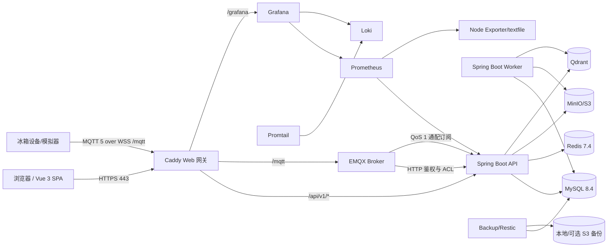

# 鲜知智慧冰箱黑盒测试与运行观测手册

版本：1.0  
更新日期：2026-08-19  
适用对象：测试、验收、运维和项目交接人员  
测试对象：Vue 3 Web、Spring Boot API/Worker、MySQL、Redis、EMQX、MinIO、Qdrant，以及生产部署/监控/备份链路

## 1. 文档目的

本文从外部使用者和运维观察者角度说明三件事：

1. 如何在本机运行项目以及系统组件如何协作。
2. 如何按可重复、可留证的方式完成全量黑盒验收。
3. 如何实时观察 MQTT 原始消息、API 入库、MySQL 状态、Worker 聚合和告警结果。

黑盒验收只依据 UI、公开 API、MQTT 设备契约、运行状态、日志、指标和数据库最终结果，不依赖内部 Java 方法实现。数据库查询仅用于验证外部动作产生的持久化结果，不直接修改业务表。

## 2. 范围和边界

### 2.1 本次覆盖

- 注册、登录、刷新、注销、修改密码和会话即时撤销。
- 单用户私有冰箱初始化、库存、批次、保质期、采购、通知和语音草稿。
- 设备注册/绑定、MQTT 5、QoS 1、去重、乱序/异常数据和环境聚合。
- 菜谱来源/导入、索引、收藏、缩放、做菜、饮食和助手降级。
- 管理员查询、启停、强退、临时密码、升降权、删除、恢复和审计。
- HTTPS、安全头、Cookie、同源写保护、生产端点收敛。
- 备份、隔离恢复、监控、日志、负载和 100 设备 MQTT 验收。

### 2.2 明确不覆盖

- 家庭共享、多用户共同拥有冰箱和 OAuth。
- 邮件、Web Push；`emailEnabled` 必须固定为 `false`。
- 未提供真实密钥时不执行 DeepSeek/OpenAI 的在线调用；提供密钥并启用开关后，必须按本文第 6.6 节和生产运行手册执行供应商实测。
- 本机内部 CA 不能替代真实公网 ACME、DNS 和防火墙验收。
- Windows Docker Desktop 不能替代 Linux 主机的 cAdvisor/cgroup 和完整宿主磁盘指标验收。
- 食品安全、营养数据和建议的专业领域审定。

## 3. 系统架构



### 3.1 组件职责

| 组件 | 主要职责 | 对外暴露 |
| --- | --- | --- |
| `web` / Caddy | SPA、HTTPS、API 代理、MQTT-over-WSS、Grafana 子路径 | 主机 80/443 |
| `api` | REST、认证授权、MQTT 鉴权/ACL、QoS 1 订阅和遥测事务入库 | 仅内部 8080 |
| `worker` | Outbox、环境聚合、保质期风险、通知、语音、菜谱导入/索引、匿名化和清理 | 不对外 |
| `mysql` | 唯一业务事实来源、审计、时序和任务状态 | 仅内部 3306 |
| `redis` | 限流、缓存和短期安全状态 | 仅内部 6379 |
| `emqx` | MQTT 连接、QoS 1、HTTP 鉴权和主题 ACL | 仅经 Caddy `/mqtt` |
| `minio` | 可选 S3 兼容语音对象 | 仅内部 |
| `qdrant` | 可重建的菜谱向量索引；MySQL 仍是权威来源 | 仅内部 |
| `backup` | 每日一致性备份、保留和隔离恢复演练 | 不对外 |
| Prometheus/Grafana/Loki | 指标、仪表盘、日志和告警 | 仅 Grafana 经 `/grafana/` |

### 3.2 MQTT 数据链路

```text
设备发布 smart-fridge/v1/{deviceId}/telemetry
  -> Caddy /mqtt (WSS)
  -> EMQX 密码鉴权 + 主题 ACL
  -> API 的 QoS 1 通配订阅
  -> telemetry_message（消息级结果）
  -> sensor_reading（合法读数）
  -> sensor 当前值/设备 last_seen
  -> Worker 聚合 zone_environment_state
  -> environment_incident / 风险累计 / 站内通知
```

API 只有在数据库事务完成或业务拒绝结果已审计后才确认消息。Broker PUBACK 只证明 Broker 接收，必须继续核对 `telemetry_message` 和 `sensor_reading`，才能证明端到端成功。

## 4. 如何运行项目（简明版）

### 4.1 当前 Windows 本机生产 Profile

前提：Docker Desktop 已启动，仓库已有 `.env.prod` 和 `secrets/`。在仓库根目录使用 PowerShell 7：

```powershell
Set-Location C:\Users\LENOVO\Desktop\smart-fridge-requirements

$Docker = (Get-Command docker.exe -ErrorAction SilentlyContinue).Source
if (-not $Docker) {
  $Docker = "$env:LOCALAPPDATA\Programs\DockerDesktop\resources\bin\docker.exe"
}

& $Docker compose --env-file .env.prod `
  -f compose.prod.yaml `
  -f compose.monitoring.yaml `
  -f compose.monitoring.desktop.yaml `
  -f compose.backup.yaml up -d

.\infra\scripts\smoke-prod.ps1
```

成功标志是脚本输出“生产冒烟通过”，并且 `api/mysql/redis/emqx/minio/qdrant` 为 `healthy`。

访问入口：

- 普通登录：<https://localhost/login>
- 管理员登录后落点：<https://localhost/admin/users>
- Grafana：<https://localhost/grafana/>
- Readiness：<https://localhost/healthz>

管理员用户名固定为 `admin`；使用初始化时保存的正式密码。当前自动化密码文件仅供获授权的本机测试脚本读取，不应复制到命令行、文档、截图或聊天记录。

停止服务但保留全部数据：

```powershell
& $Docker compose --env-file .env.prod `
  -f compose.prod.yaml `
  -f compose.monitoring.yaml `
  -f compose.monitoring.desktop.yaml `
  -f compose.backup.yaml stop
```

禁止在有数据的环境执行 `docker compose down -v`。首次部署、迁移、管理员初始化、回滚和证书说明见 [生产运行手册](production-runbook.md)。

### 4.2 开发 Profile

需要调试 Simulator 或开发专用遥测端点时使用开发 Compose，不要把开发 Profile 当成生产验收结果：

```powershell
Copy-Item .env.example .env   # 仅首次且文件不存在时
& $Docker compose --profile simulator up --build -d

Set-Location frontend
npm ci
npm run dev
```

生产 Profile 会关闭 Debug、Simulator 和 Swagger。

## 5. 黑盒测试管理规范

### 5.1 测试环境与角色

| 角色 | 用途 | 约束 |
| --- | --- | --- |
| 游客 | 注册、登录失败和访问控制 | 不持有 Token |
| 普通用户 A | 主业务正向流程 | 独立冰箱和数据 |
| 普通用户 B | 越权隔离验证 | 不得看到用户 A 资源 |
| 管理员 | 用户生命周期和运维 | 不要求冰箱初始化 |
| MQTT 设备 | 正式设备凭据/主题 | 凭据只返回一次 |
| MQTT 非法客户端 | 鉴权和 ACL 反向用例 | 只使用专用测试账号 |

测试账号使用 `bb_<日期>_<编号>` 命名；邮箱使用 `.invalid` 测试域。不得使用真实个人邮箱、真实食品隐私数据或生产业务用户执行破坏性用例。

### 5.2 准入条件

- 测试镜像使用不可变版本或记录本地镜像 ID。
- `.env.prod` 已通过 Compose 配置校验，Secret 不含默认值。
- 发布前备份已成功，MySQL 当前 Flyway 版本为 V013。
- API、MySQL、Redis、EMQX readiness 正常。
- 测试人员明确本次是否允许创建、禁用、重置和软删除临时账号。

### 5.3 退出条件

- P0/P1 用例 100% 通过，其余计划用例通过率不低于 95%。
- 无已知 P1/P2 缺陷；所有失败有缺陷编号、日志、traceId 和复现步骤。
- 管理员、身份、库存、MQTT、备份恢复和安全门禁全部通过。
- 负载满足读取 p95 < 500 ms、写入 p95 < 800 ms、错误率 < 1%。
- 100 设备 QoS 1 的 PUBACK、消息、`ACCEPTED` 和读数计数一致。
- 测试账号/设备已停用或软删除，临时凭据和导出文件已安全清理。

### 5.4 缺陷等级

| 等级 | 定义 | 示例 |
| --- | --- | --- |
| P1 | 数据泄漏、认证绕过、不可恢复丢失、系统不可用 | 跨用户读取、最后管理员被删除、备份不可恢复 |
| P2 | 核心流程错误或数据不一致，无可靠绕行 | 重复扣减、禁用后 Token 仍有效、MQTT 静默丢失 |
| P3 | 次要功能错误，有明确绕行 | 非核心筛选错误、局部响应式问题 |
| P4 | 文案、样式和低风险体验问题 | 对齐、非关键信息提示 |

## 6. 黑盒测试用例

表中“自动化”是已有的第一选择；没有自动化的用例按步骤人工执行并留证。

### 6.1 启动、网关与生产安全

| ID | 优先级 | 场景与步骤 | 期望结果 | 自动化/证据 |
| --- | --- | --- | --- | --- |
| BB-OPS-001 | P0 | 启动完整生产 Compose，查看所有服务状态 | API/MySQL/Redis/EMQX/MinIO/Qdrant Healthy，其余服务 Running | `smoke-prod.ps1`、`compose ps` |
| BB-OPS-002 | P0 | 请求 HTTP 首页和 HTTPS `/healthz` | HTTP 30x 到 HTTPS；readiness 为 `UP` | `smoke-prod.ps1` |
| BB-OPS-003 | P0 | 检查 HSTS、nosniff、DENY frame、Referrer-Policy | 所有安全头存在 | `smoke-prod.ps1` |
| BB-OPS-004 | P0 | 检查刷新 Cookie | `Secure`、`HttpOnly`、`SameSite=Lax/Strict` | `smoke-prod.ps1` |
| BB-OPS-005 | P0 | 访问 Swagger、Debug 和内部端口 | Swagger/Debug 404；数据库/Broker 管理端口未映射到主机 | 脚本 + `compose ps` |
| BB-OPS-006 | P1 | 重启 API/Worker/Web，不删除卷，再登录和查询 | 服务恢复，已有用户和业务数据保持 | 前后截图/查询 |
| BB-OPS-007 | P0 | 从跨站 Origin 发起写请求 | 403 `CROSS_ORIGIN_REQUEST_REJECTED` | `smoke-prod.ps1` |

### 6.2 身份、会话与路由

| ID | 优先级 | 场景与步骤 | 期望结果 |
| --- | --- | --- | --- |
| BB-AUTH-001 | P0 | 以合法用户名、邮箱、密码注册 | 201；返回 USER/ACTIVE；Token 只在响应/安全 Cookie 中 |
| BB-AUTH-002 | P1 | 重复用户名或邮箱注册 | 409 明确冲突码；不创建第二个账号 |
| BB-AUTH-003 | P0 | 分别用邮箱、大小写用户名登录 | 均进入同一账号；用户名规范化 |
| BB-AUTH-004 | P0 | 错误密码和不存在账号登录 | 都返回 401 `INVALID_CREDENTIALS`，不泄漏账号存在性 |
| BB-AUTH-005 | P1 | 连续失败触发限流，等待 `Retry-After` 后重试 | 返回 429；窗口结束后可恢复 |
| BB-AUTH-006 | P0 | 刷新两次，再复用旧刷新令牌 | 正常轮换；旧令牌重放导致会话族撤销 |
| BB-AUTH-007 | P0 | 注销后刷新和访问 `/me` | 刷新失败，Cookie 清除，旧 Access Token 按会话状态失效 |
| BB-AUTH-008 | P0 | 管理员禁用/强退/重置用户后立即使用旧 Token | 立即 401，不等待 JWT 自然过期 |
| BB-AUTH-009 | P0 | 用临时密码登录并访问普通业务 API | 403 `PASSWORD_CHANGE_REQUIRED`；仅 `/me`、改密和注销可用 |
| BB-AUTH-010 | P0 | 普通用户直接访问 `/admin/users` | 被路由守卫移出，API 返回 403；管理员无需 onboarding 可进入 |

### 6.3 首次初始化与用户隔离

| ID | 优先级 | 场景与步骤 | 期望结果 |
| --- | --- | --- | --- |
| BB-ONB-001 | P0 | 新用户登录 | 进入初始化页，不能提前进入普通主界面 |
| BB-ONB-002 | P0 | 创建 3–6 个合法分区和传感器槽位 | 一次事务完成，冰箱/分区/槽位可查询 |
| BB-ONB-003 | P1 | 提交重复分区名、超限数量或非法目标值 | 400，数据库无部分数据 |
| BB-ONB-004 | P0 | 同一 `Idempotency-Key` 和同一请求重复提交 | 返回首次响应，不创建重复冰箱 |
| BB-ONB-005 | P0 | 同一键提交不同请求体 | 409 `IDEMPOTENCY_KEY_REUSED` |
| BB-ONB-006 | P0 | 用户 B 使用用户 A 的冰箱/分区/库存 UUID | 404/403，不泄漏资源详情 |

### 6.4 库存、保质期和采购

| ID | 优先级 | 场景与步骤 | 期望结果 |
| --- | --- | --- | --- |
| BB-INV-001 | P0 | 创建食材、批次并刷新页面 | 数量、单位、分区、日期持久化一致 |
| BB-INV-002 | P0 | 对批次执行 ADJUST/CONSUME/DISCARD | 前后数量和流水一致，不能变负数 |
| BB-INV-003 | P0 | 并发扣减同一批次 | 只有合法事务成功，无超卖和负库存 |
| BB-INV-004 | P0 | 相同幂等键重复创建/扣减 | 只产生一个业务结果和一条相应流水 |
| BB-INV-005 | P1 | 使用不可转换单位扣减 | 422/409 明确错误，不猜测换算 |
| BB-INV-006 | P1 | 有活动批次时删除食材 | 409；历史数据保持 |
| BB-INV-007 | P0 | 分别提供包装日期、用户保质期、目录默认值和无依据数据 | 到期来源按优先级选择；无依据为 `UNKNOWN` |
| BB-INV-008 | P1 | 创建采购项并执行入库 | 采购置为 STORED、批次/IN 流水/Outbox 同事务完成 |
| BB-INV-009 | P1 | 人为制造入库中途失败 | 整体回滚，不出现孤立批次或已入库状态 |
| BB-INV-010 | P1 | 切换 C/F 偏好并刷新 | 领域值仍为摄氏，显示值按偏好一致转换 |

### 6.5 MQTT、环境和通知

| ID | 优先级 | 场景与步骤 | 期望结果 |
| --- | --- | --- | --- |
| BB-MQTT-001 | P0 | 普通用户在“设置 → 冰箱分区与探头”选择待绑定槽位并初始化 | 自动创建 PHYSICAL 设备并绑定槽位；一次展示 Broker、Client ID、用户名、密码、Topic 和 Sensor ID；可复制或下载配置 |
| BB-MQTT-002 | P0 | 设备发布自己的主题并订阅任意主题 | 自有发布允许；设备订阅和跨设备发布被 ACL 拒绝 |
| BB-MQTT-003 | P0 | WSS QoS 1 发布合法 GOOD 温度/湿度 | PUBACK；`telemetry_message=ACCEPTED`；对应读数各一条 |
| BB-MQTT-004 | P0 | 重发相同 `messageId` | 不重复写读数；去重结果可追踪 |
| BB-MQTT-005 | P1 | 发布未来超限、错误 Schema、跨设备 sensorId 或物理越界值 | 消息被拒绝且有错误码；不更新当前值 |
| BB-MQTT-006 | P1 | 发布 48 小时内乱序 GOOD 读数 | 历史读数保存，但不覆盖最新当前值 |
| BB-MQTT-007 | P1 | 发布变化速率超限读数 | 质量为 SUSPECT，不影响当前环境；连续异常产生事件 |
| BB-MQTT-008 | P0 | 持续越界 15 分钟，再恢复正常 15 分钟 | 事件 OPEN 后 CLOSED；风险只增不回退；站内通知去重 |
| BB-MQTT-009 | P1 | 停止数据超过陈旧阈值 | 环境状态/事件明确显示 STALE，不伪装为正常 |
| BB-MQTT-010 | P0 | 禁用/删除用户后保持旧 MQTT 连接并尝试重连 | 旧连接不能继续有效入库，旧凭据重连失败 |
| BB-MQTT-011 | P0 | 运行 100 设备 QoS 1 门禁 | PUBACK、消息、ACCEPTED、读数均 100，无静默丢失 |
| BB-MQTT-012 | P0 | 并发初始化同一待绑定槽位，或用另一普通用户初始化该槽位 | 只有一个事务成功；重复绑定返回 409；越权返回 404；不产生孤立设备 |
| BB-NOT-001 | P1 | 触发临期、过期、低库存和环境事件 | 只生成站内通知；静默时段和去重生效 |
| BB-NOT-002 | P1 | 尝试开启邮件 | API 响应中 `emailEnabled=false`，无邮件投递 |

### 6.6 语音、菜谱、饮食和助手

| ID | 优先级 | 场景与步骤 | 期望结果 |
| --- | --- | --- | --- |
| BB-VOICE-001 | P1 | 上传语音并等待 Worker | 先生成草稿，不直接写库存；成功后为可编辑 READY |
| BB-VOICE-002 | P1 | 编辑并确认草稿 | 复用普通库存事务，只入库一次，音频按保留策略删除 |
| BB-VOICE-003 | P1 | 存储/转写失败或 provider 禁用 | 明确失败/不可用，手工入库仍正常，无半成品库存 |
| BB-REC-001 | P1 | 管理员创建带许可证来源并重复导入 | 来源可追溯；指纹去重；任务计数和错误可查 |
| BB-REC-002 | P1 | 失败导入重试 | 新状态可追踪，不覆盖成功版本，不丢失失败原因 |
| BB-REC-003 | P1 | 执行版本化索引重建 | 新集合完成后切换；失败保持旧索引可用 |
| BB-REC-004 | P0 | 按时间、口味、热量、目标和库存组合筛选 | AND 语义正确，过敏/忌口永远排除 |
| BB-REC-005 | P1 | 缩放主食材和调味品 | 主/配料按规则，调味品有界缩放，总量/每份营养一致 |
| BB-REC-006 | P0 | 确认做菜 | 实际可转换批次原子扣减；不可扣减项明确返回 |
| BB-AI-001 | P1 | AI/Embedding 关闭或 Qdrant 不可用 | MySQL/规则降级仍可返回；核心业务不依赖外部模型 |
| BB-AI-002 | P1 | 模型返回超时、429/5xx 或错误 Schema | 有限重试/熔断生效，无未校验写操作 |
| BB-AI-003 | P0 | 助手提出写操作 | 只生成可确认草案；确认前不改变库存/采购 |

启用 DeepSeek + OpenAI 后，先执行：

```powershell
.\infra\scripts\set-ai-provider-secrets.ps1 -EnableProduction
docker compose --env-file .env.prod -f compose.prod.yaml config --quiet
docker compose --env-file .env.prod -f compose.prod.yaml up -d --build api worker
```

然后使用普通用户的已初始化账号发送一个中文助手问题，检查响应的 `fallback=false`；上传短中文音频检查语音草稿从 `PROCESSING` 进入 `READY`；管理员执行 `POST /api/v1/admin/search-index/rebuild` 并观察新 1536 维集合完成切换。任何供应商超时、429、5xx 或错误 Schema 都必须回退/失败，不得写入未确认的库存。

### 6.7 管理员和账号生命周期

以下完整链路已有真实生产 Profile 脚本。脚本会创建唯一临时用户并最终软删除，只能在批准的验收窗口执行。

| ID | 优先级 | 场景与步骤 | 期望结果 |
| --- | --- | --- | --- |
| BB-ADM-001 | P0 | 普通用户请求任一管理员 API | 403，不泄漏用户列表 |
| BB-ADM-002 | P0 | 按关键词、角色、状态分页查询 | 默认 20、最大 100；总数和页数正确 |
| BB-ADM-003 | P0 | 禁用再启用用户 | 禁用即时撤销会话；启用后可重新登录 |
| BB-ADM-004 | P0 | 强制退出用户 | Access/Refresh 全部立即失效 |
| BB-ADM-005 | P0 | 重置密码 | 24 位临时密码只在响应显示一次，24 小时过期，强制改密 |
| BB-ADM-006 | P0 | 升降 USER/ADMIN | 权限即时变化，降权撤销旧会话 |
| BB-ADM-007 | P0 | 软删除并在 90 天内恢复 | 删除后不可登录；恢复后状态正确；用户名不被占用释放 |
| BB-ADM-008 | P0 | 恢复已匿名化账号 | 409 `USER_ANONYMIZED`，不可逆恢复 |
| BB-ADM-009 | P0 | 管理员停用/降权/删除自己 | 明确拒绝 |
| BB-ADM-010 | P0 | 两个请求并发破坏最后有效管理员 | 事务锁保证至少保留一个有效管理员 |
| BB-ADM-011 | P0 | 查看目标用户审计 | 记录操作人、目标、动作和结果；不含密码、Token、完整邮箱 |
| BB-ADM-012 | P1 | 管理写请求缺少或复用不同请求的幂等键 | 缺少键被拒绝；不同请求复用返回 409 |

执行：

```powershell
.\infra\scripts\smoke-admin-lifecycle.ps1
```

### 6.8 UI、响应式和可访问性

| ID | 优先级 | 场景与步骤 | 期望结果 |
| --- | --- | --- | --- |
| BB-UI-001 | P0 | 普通用户/管理员登录 | 分别落到主界面/`/admin/users` |
| BB-UI-002 | P1 | 桌面筛选、分页、确认对话框和临时密码 | 状态反馈清楚，临时密码关闭后不能再次显示 |
| BB-UI-003 | P1 | 390×844 移动视口访问管理后台 | 使用卡片布局，无横向溢出，关键动作可完成 |
| BB-UI-004 | P1 | 仅键盘 Tab/Shift+Tab/Enter/Escape 操作 | 焦点可见、顺序合理、对话框焦点不逃逸 |
| BB-UI-005 | P1 | 刷新深层链接和浏览器前进/后退 | SPA 不 404，认证/角色守卫保持正确 |

前端 Playwright 当前使用 Mock API，适合验证 UI、路由和响应式；它不能替代真实生产 API 冒烟：

```powershell
Set-Location frontend
npm ci
npx playwright install chromium
npm run test:e2e
```

### 6.9 备份、监控和非功能门禁

| ID | 优先级 | 场景与步骤 | 期望结果 |
| --- | --- | --- | --- |
| BB-DR-001 | P0 | 执行即时一致性备份 | 新备份非空、gzip 完整、成功指标更新 |
| BB-DR-002 | P0 | 在 `xianzhi_restore_drill` 隔离 schema 恢复 | 表数 >10、查询正常，演练 schema 最终删除 |
| BB-DR-003 | P0 | 模拟备份失败 | 不发布损坏文件，告警/失败指标可见 |
| BB-MON-001 | P0 | 查看 API 指标和 Worker 心跳 | `xianzhi_mqtt_connected=1`，心跳年龄 <120 秒 |
| BB-MON-002 | P1 | 产生受控错误并用 traceId 查询 Loki | 能定位同一请求，日志无密码/Token/完整邮箱 |
| BB-PERF-001 | P0 | 50 VU 运行 60 秒 | 读取 p95 <500 ms，写入 p95 <800 ms，错误率 <1% |
| BB-PERF-002 | P0 | 100 设备并发 QoS 1 | 四层计数全部 100，无静默丢失 |

备份与恢复：

```powershell
& $Docker compose --env-file .env.prod `
  -f compose.prod.yaml -f compose.monitoring.yaml -f compose.backup.yaml `
  run --rm --entrypoint /opt/xianzhi/backup.sh backup

& $Docker compose --env-file .env.prod `
  -f compose.prod.yaml -f compose.monitoring.yaml -f compose.backup.yaml `
  run --rm --entrypoint /opt/xianzhi/restore-drill.sh backup
```

负载与 100 设备命令见 [负载验收说明](../infra/load/README.md)。负载测试会写测试数据，只能在批准窗口执行。

## 7. 实时观察 MQTT 与 MySQL

### 7.1 推荐的三终端联动

在三个 PowerShell 终端同时运行：

终端 A——观察 Broker 转发的原始 MQTT 遥测：

```powershell
# 仅首次安装 Python MQTT 依赖
python -m pip install --target .tmp/mqtt-watch -r infra/load/requirements.txt

.\infra\scripts\watch-mqtt.ps1 -Compact
# 只看某台设备：
# .\infra\scripts\watch-mqtt.ps1 -DeviceId '<device-uuid>'
```

该脚本通过正式 `wss://<APP_DOMAIN>/mqtt` 连接，以服务账号只读订阅 `smart-fridge/v1/+/telemetry`。它不会打印密码，但会显示设备/传感器 UUID 和遥测值；共享屏幕或导出日志前仍需按敏感运行数据处理。

终端 B——每 2 秒观察 MySQL 的消息、读数、环境状态、库存流水、Outbox 和心跳：

```powershell
.\infra\scripts\watch-mysql.ps1 -IntervalSeconds 2 -Limit 10

# 只查询一次：
.\infra\scripts\watch-mysql.ps1 -Once -Limit 20
```

脚本不开放 MySQL 端口，不输出数据库密码，只执行预置 `SELECT`。库存区不显示食材名称和幂等键，Outbox 区不显示事件 payload 和错误详情；轮询间隔不要低于 1 秒，生产排障通常使用 2–5 秒。

终端 C——观察 API、Worker 和 EMQX 日志：

```powershell
& $Docker compose --env-file .env.prod -f compose.prod.yaml `
  logs -f --tail 100 api worker emqx
```

停止任一观察器使用 `Ctrl+C`。

### 7.2 一条消息应看到什么

1. MQTT 终端先出现主题、QoS 和原始 JSON。
2. MySQL 的“最新 MQTT 消息”出现同一 `messageId`，合法消息为 `ACCEPTED`。
3. “最新传感器读数”出现对应 sensorId、value、unit 和 quality。
4. 设备 `last_seen` 和传感器当前值更新；环境聚合按 Worker 调度稍后反映到 `zone_environment_state`。
5. 满足持续时间门槛后，`environment_incident`、风险评估和站内通知才变化。瞬时越界不应立即制造持续事件。

若只看到 MQTT、没有 MySQL：先检查 API 日志中的 Schema/ACL/归属拒绝和 `xianzhi_mqtt_connected`。若 `telemetry_message` 为 `ACCEPTED` 但没有读数，核对 payload 中 sensorId、metric 和物理范围。若读数存在但环境状态未变化，检查 Worker 心跳和调度窗口。

### 7.3 指标和 Grafana

Grafana 入口：<https://localhost/grafana/>。用户名为 `admin`，密码使用获授权的 `secrets/grafana_admin_password`，不要在终端打印或截图中暴露。

直接查看关键指标：

```powershell
& $Docker compose --env-file .env.prod -f compose.prod.yaml exec -T api `
  curl --fail --silent http://localhost:8080/actuator/prometheus |
  Select-String 'xianzhi_mqtt_connected|xianzhi_worker_heartbeat_age_seconds|xianzhi_outbox_pending|xianzhi_recipe'
```

关键含义：

- `xianzhi_mqtt_connected 1`：API 的正式 MQTT 订阅在线。
- `xianzhi_mqtt_connection_failures_total`：累计连接失败次数。
- `xianzhi_worker_heartbeat_age_seconds`：Worker 最近心跳年龄，应小于 120 秒。
- `xianzhi_outbox_pending`：Outbox 待处理数量；持续上升需要排障。
- `xianzhi_recipe_import_queued` / `xianzhi_recipe_index_rebuild_active`：导入和索引任务状态。

## 8. 自动化回归顺序

建议每次候选发布按以下顺序执行，任一 P0 失败立即停止发布：

```powershell
# 1. 生产实链路
.\infra\scripts\smoke-prod.ps1

# 2. 管理员真实生命周期（会创建并软删除临时用户）
.\infra\scripts\smoke-admin-lifecycle.ps1

# 3. 后端契约/集成/覆盖率
Set-Location backend
.\mvnw.cmd verify

# 4. 前端单测、构建和 Mock API UI E2E
Set-Location ..\frontend
npm ci
npm test
npm run build
npm run test:e2e
```

之后执行备份恢复、镜像扫描、50 VU 和 100 设备门禁。测试日志不得包含 `secrets/` 内容。

## 9. 测试记录模板

每次验收复制以下表格到独立报告：

| 字段 | 内容 |
| --- | --- |
| Run ID | `BB-YYYYMMDD-NN` |
| 镜像/提交 | API、Web、Backup 镜像 ID和 Git commit |
| 环境 | 主机、CPU/内存、Docker、域名、证书类型 |
| 开始/结束时间 | 使用带时区的时间 |
| 执行人/复核人 | 姓名或受控账号 |
| 数据集 | 测试账号前缀、设备数量、是否清理 |
| 结果 | Passed / Failed / Blocked |
| 缺陷 | 编号、等级、影响和复现概率 |
| 证据 | 截图、脚本输出、traceId、Grafana/Loki 时间窗、备份 ID |

单用例记录：

| 用例 ID | 实际步骤/数据 | 预期 | 实际 | 结果 | 证据/缺陷 |
| --- | --- | --- | --- | --- | --- |
| BB-… | 不记录密码/Token | … | … | Pass/Fail | traceId/截图路径 |

## 10. 当前已知验收基线

2026-08-19 本机生产 Profile 已取得以下结果：

- 后端 63/63、前端 25/25、Playwright 5 passed/3 skipped。
- V001→V013 空库和 V002→V013 原地升级通过。
- API/Web/Backup 的 OS 与应用二进制 Trivy High/Critical 均为 0。
- 内部 CA HTTPS/WSS、管理员生命周期、Worker、S3、备份和隔离恢复通过。
- 50 VU：读取 p95 34.74 ms、写入 p95 36.21 ms、错误率 0%。
- 100 设备：PUBACK、`telemetry_message`、`ACCEPTED`、`sensor_reading` 均为 100。

该结果只代表当时的镜像、主机和配置。镜像、依赖、数据库参数、域名、证书、外部供应商或网络拓扑变化后必须重新验收。
